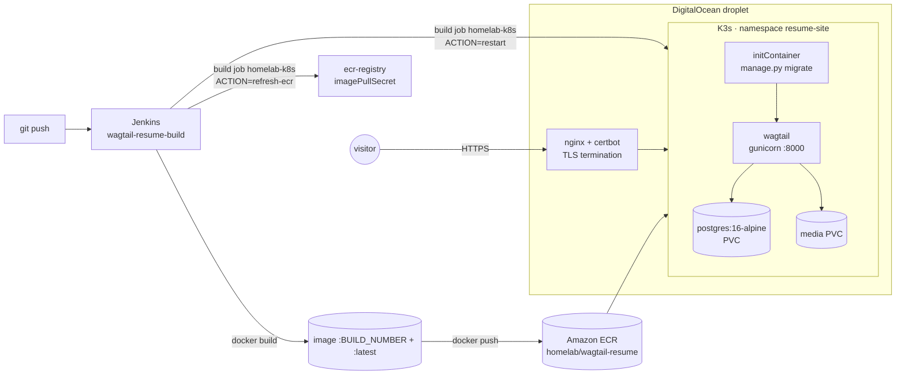

# wagtail-k3s-cicd

The source and delivery pipeline for my resume and portfolio site,
**https://resume.nonagonmedia.net**. It's a small Wagtail (Django) CMS that Jenkins builds
into a Docker image, pushes to Amazon ECR, and rolls out to a single-node K3s cluster on a
DigitalOcean droplet, with nginx and Let's Encrypt in front.

This repository is what the live site runs from. The content (jobs, skills, project write-ups,
images) lives in the site's Postgres database and is edited in the Wagtail admin, so it isn't
in this repo. Infrastructure identifiers (the AWS account, registry, cluster and job names) are
placeholders.

## Architecture



## Content model

All models are in `home/models.py`.

- **Page tree:** `HomePage` → `SkillsPage`, `ExperiencePage`, `ProjectsPage` → `ProjectPage`, and
  `ContactPage`. Page types are restricted with `parent_page_types` / `subpage_types`, so editors
  can't build an invalid tree.
- **Snippets:** `Job`, `Skill`, `Certification` (and a legacy `Project` snippet).
- **Skills are linked to evidence, not shown as percentage bars.** Each `ProjectPage` has a
  comma-separated `technologies` field that serves as its tag list. A `Skill` matches a project
  when the skill's name, or any of its `match_tags` aliases (for example "Amazon ECR, AWS Secrets
  Manager" count as AWS), appears in those tags. `SkillsPage.get_skills_by_category()` groups the
  skills by category, and each skill expands to the projects that show it. A skill that no live
  project covers falls back to its `related_jobs`, which link to anchors on the Experience page.
  The old `percentage` field is still in the schema but no longer used.
- **Project pages** use a challenge → solution → details structure, with an optional
  architecture **diagram** image and caption, a code sample, and GitHub/demo links. The home page
  shows icon rows built from `Job.icon` and `ProjectPage.icon` / `short_name`.

## Pipeline (`Jenkinsfile`)

1. **Build and publish**, on an agent labelled `ansible`:
   - Checkout, then `docker build`, tagging the image with both the build number and `latest`.
   - **Push to ECR:** AWS keys come from a Jenkins credential via `withCredentials`, and the
     `amazon/aws-cli` container receives them as bare `-e AWS_ACCESS_KEY_ID -e AWS_SECRET_ACCESS_KEY`
     (the values never appear on the command line). The registry token is piped straight into
     `docker login --password-stdin`.
   - A `post { always }` block removes the local image tag on the agent that built it.
2. **Refresh ECR credentials:** triggers the separate `homelab-k8s` job (`ACTION=refresh-ecr`)
   to renew the `ecr-registry` imagePullSecret, because ECR tokens expire after 12 hours.
3. **Deploy:** triggers `homelab-k8s` again with `ACTION=restart` for the `wagtail` deployment, so
   the pod pulls the new `:latest` image.

The pipeline runs with `agent none` at the top level on purpose. The two deploy stages only wait
on a downstream job that runs on another node. If they held an executor while waiting, a small
agent could deadlock, which is what happened once before this change (see the comment at the top of
the `Jenkinsfile`).

## Database migrations

The `wagtail` Deployment runs an **init container** from the same image that executes
`python manage.py migrate --noinput` before gunicorn starts. Every rollout applies any new
migrations in `home/migrations/` against the in-cluster Postgres before the new code serves
traffic, with no manual step. Schema changes ship
as normal Django migrations (e.g. `0003_skill_links` added `match_tags` and `related_jobs`).

## Kubernetes manifests (`k8s/`)

| File | Contents |
|------|----------|
| `postgres.yaml` | PVC (`local-path`), Postgres 16 Deployment, ClusterIP Service |
| `wagtail.yaml` | media PVC, ConfigMap, Deployment (init-container migrate, readiness/liveness probes on `/admin/login/`), Service |
| `ingress.yaml` | Traefik Ingress with a cert-manager `letsencrypt-prod` issuer (in-cluster TLS option) |
| `secrets.yaml.example` | `postgres-secret` / `wagtail-secret` with `CHANGE_ME` placeholders; copy to `secrets.yaml` (git-ignored) |

`deploy/nginx/resume-site.conf.example` shows the host-level nginx server block used on the
droplet: HTTP→HTTPS redirect, ACME challenge path, certbot certificate, and `proxy_pass` to a NodePort. The `wagtail` Service in
`k8s/wagtail.yaml` is ClusterIP, so exposing it on that NodePort is a separate step for this path.

## Running it

```bash
# Build and run the image locally against a Postgres you provide
docker build -t wagtail-resume .
docker run --rm -p 8000:8000 \
  -e POSTGRES_HOST=host.docker.internal -e POSTGRES_PASSWORD=... -e DJANGO_SECRET_KEY=... \
  wagtail-resume
docker run --rm -e POSTGRES_HOST=... -e POSTGRES_PASSWORD=... wagtail-resume \
  python manage.py createsuperuser

# Cluster (first time)
kubectl create namespace resume-site
cp k8s/secrets.yaml.example k8s/secrets.yaml   # fill in values
kubectl apply -f k8s/secrets.yaml -f k8s/postgres.yaml -f k8s/wagtail.yaml
```

There is only a production settings module (`resume_site/settings/production.py`, the default in
`manage.py`); it reads the database connection and
`DJANGO_SECRET_KEY` from the environment. Static files are collected at image build time and
served by WhiteNoise.

## Layout

```
Dockerfile             python:3.12-slim, collectstatic at build, gunicorn on :8000
Jenkinsfile            build → push to ECR → refresh pull secret → restart
k8s/                   namespace resources (see above)
deploy/nginx/          host nginx + Let's Encrypt example
home/                  models, migrations, page templates
resume_site/           settings (base / production), urls, wsgi
templates/base.html    site shell (header, nav, footer)
```

## Stack

Python 3.12 · Django 5.0 · Wagtail 6.3 · PostgreSQL 16 · gunicorn · WhiteNoise · Docker ·
Jenkins · Amazon ECR · K3s · Traefik/cert-manager or nginx + certbot · DigitalOcean

## License

MIT. See [LICENSE](LICENSE).
